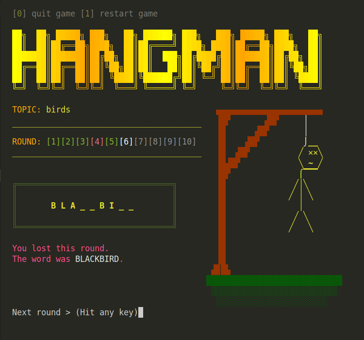

# Terminal Hangman

This is a simple Hangman game for the terminal, written in vanilla JavaScript. No UI, no fancy frameworks – just pure console.log() magic. I originally created it as a fun and creative school project.

✨ Features

- Classic Hangman gameplay – guess the word before it's too late!
- Styled with chalk & gradients (if your terminal supports it)

⚠️ Terminal Compatibility

The game looks awesome in a Linux terminal with chalk enabled. Other terminals? Well… let's just say your mileage may vary. Some special characters might not render perfectly, but the game is still fully playable!
If the visuals look weird, try running it in a terminal that supports UTF-8 and colors (e.g., Windows Terminal, VS Code Terminal, or a good old Linux shell).

🚀 How to Play

1. Clone the repo
2. Run `npm install` to get the dependencies
3. Start the game with: `node game.js `
4. Guess letters and have fun!

If everything works correctly, the game should look like this (or similar ;)):

I'm not actively maintaining this project, but feel free to fork it, improve it, or just enjoy it as it is. Have fun, and happy guessing!
